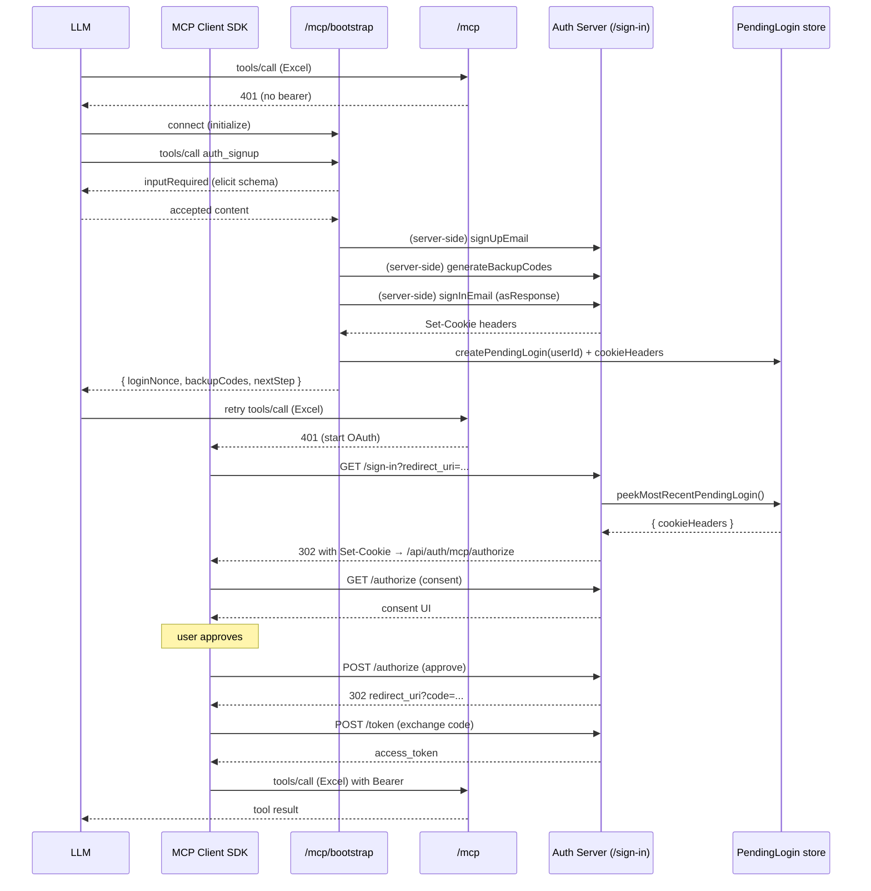

# T-44 — Signup flow doc + sequence diagram

- **Difficulty:** 🟢 easy
- **Type:** Documentation
- **Dependencies:** T-41, T-42, T-43 (need the actual tool shapes to
  document accurately)
- **Output:** `tickets/real-auth/notes/SIGNUP_FLOW.md` (cross-
  referenced from `AGENTS.md` once T-71 lands)

## Goal

A single readable document that walks through the entire real-mode
bootstrap + recovery flow end-to-end: what the LLM calls, what the
server does, what the client SDK does, and where each piece lives
in the code. This is the document an operator or implementer reads
to understand the whole system without re-reading every ticket.

## Scope

The document covers:

1. **Discovery** — how the LLM ends up at `/mcp/bootstrap` after
   the 401 from `/mcp`. Documents that this is the LLM host's
   responsibility (the server doesn't advertise `/mcp/bootstrap`
   via any metadata endpoint).
2. **Signup sequence** (Mermaid sequence diagram):
   - LLM → `/mcp/bootstrap` → `auth_signup` (elicitation).
   - Client ↔ LLM elicitation round trip.
   - Server: `signUpEmail` → `generateBackupCodes` → `signInEmail`
     (asResponse) → captures cookies → pending-login entry.
   - Server → LLM: `{ loginNonce, backupCodes }`.
   - LLM retries the original Excel tool call.
   - Client SDK: 401 → starts OAuth → `/sign-in` →
     `peekMostRecentPendingLogin` → cookies re-emitted → 302 to
     `/api/auth/mcp/authorize` → consent screen → user approves →
     `/api/auth/mcp/token` → bearer → Excel tool call succeeds.
3. **Signin sequence** — same shape but `auth_signin` with
   password or magic-link token.
4. **Recovery sequence** — `auth_recover` → backup-code verify →
   recovery session → retry → `auth_add_passkey` / `auth_rotate_apikey`
   as follow-up.
5. **Failure modes**:
   - Client declines elicitation → tool returns text, LLM gives up
     or retries.
   - Wrong password → `signInEmail` returns non-200 → tool returns
     error text, no pending-login entry, no session.
   - Pending-login expired (LLM takes >5 min between signup and
     retry) → `/sign-in` finds no pending entry → renders polling
     page → eventually times out → LLM must call `auth_signup` /
     `auth_signin` again.
   - Server restart between signup and retry → pending-login map
     is empty → same as expired.
6. **Mode comparison** — a small table contrasting demo and real
   mode behavior for the same operations. Demo: auto-login, no
   consent. Real: elicitation, real consent, real session.
7. **File map** — every file touched by the real-auth plan, with
   one-line descriptions. Helpful for code review.

## Mermaid diagram example (to be embedded)

## Verify

- The document exists at `tickets/real-auth/notes/SIGNUP_FLOW.md`.
- The Mermaid diagram renders correctly (paste into a Mermaid
  previewer or GitHub comment).
- Each step in the diagram maps to a concrete file/function in the
  codebase (line references where useful).
