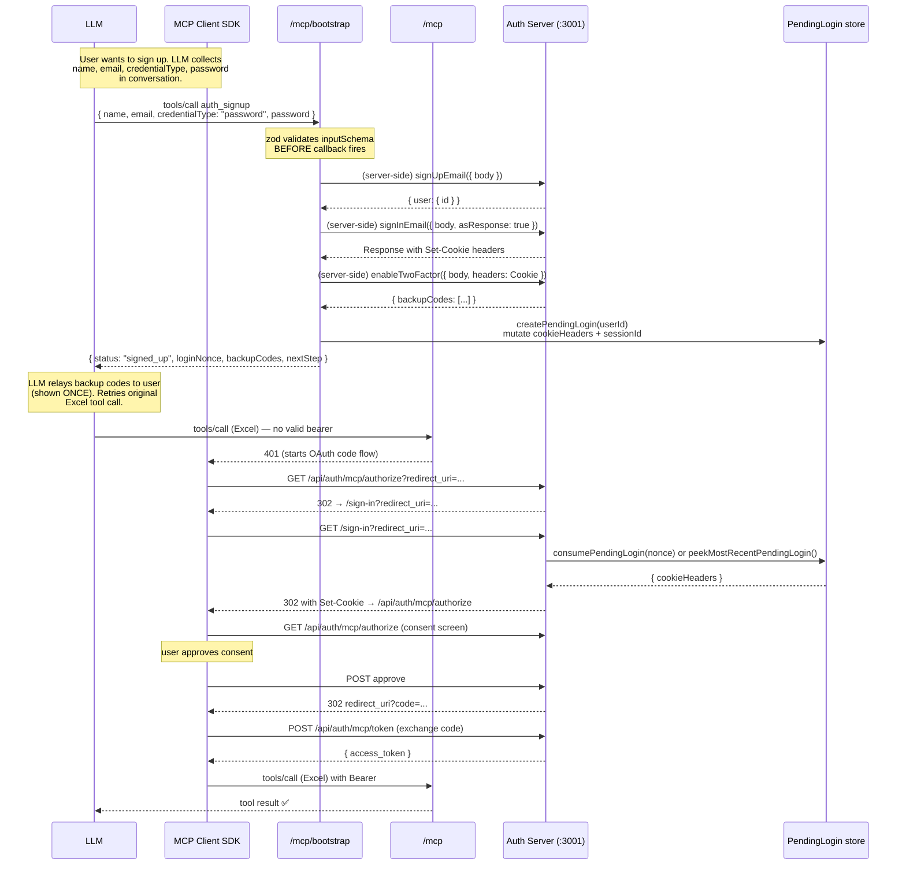
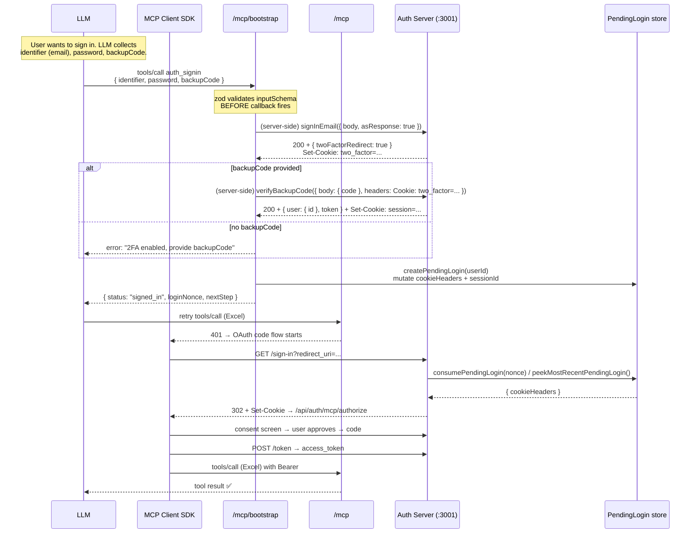
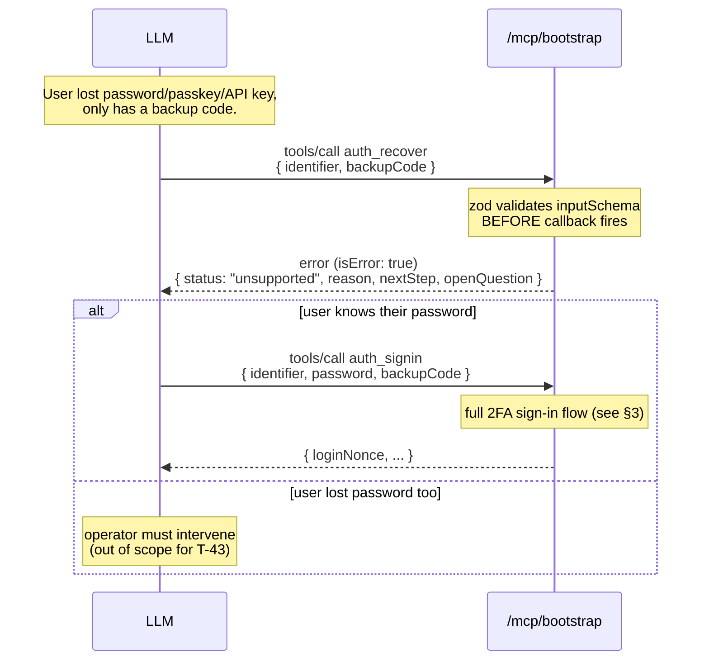
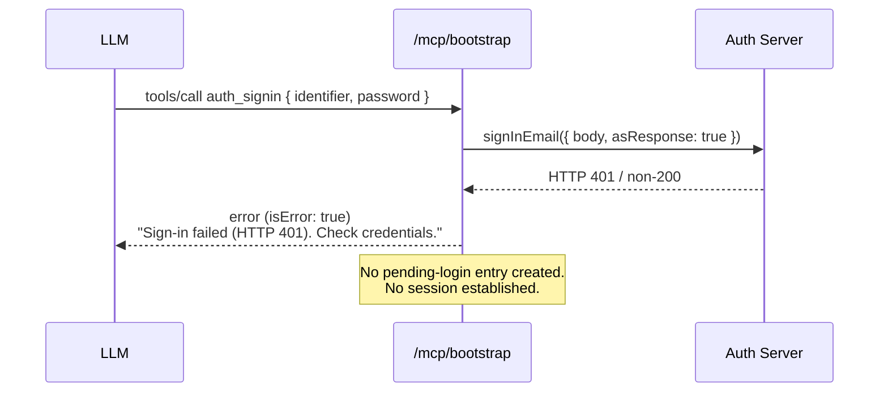
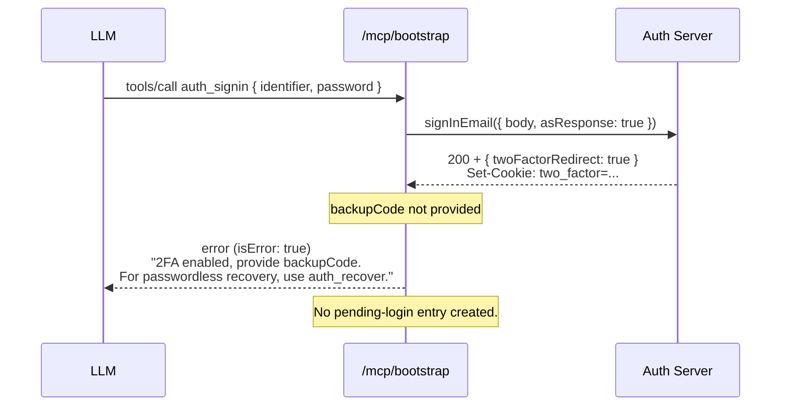
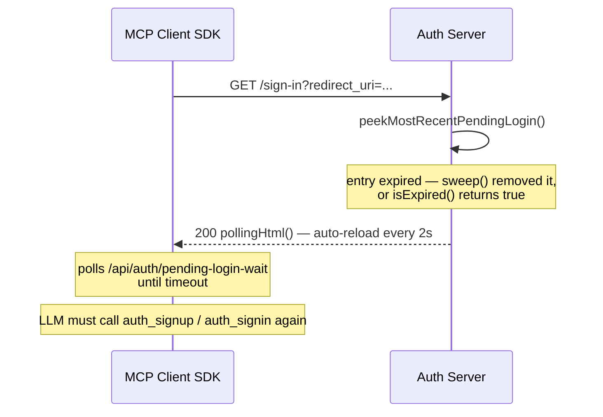
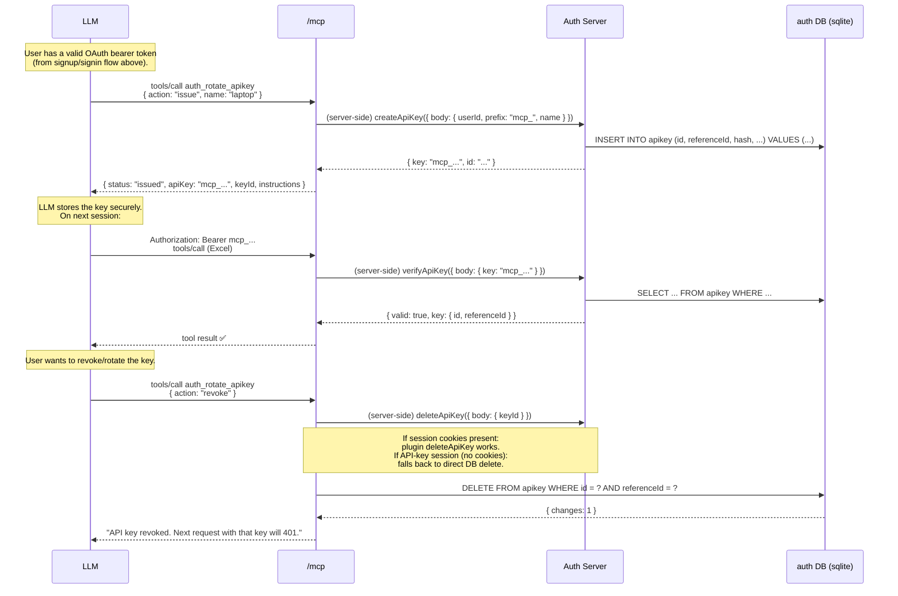

# Signup Flow — Real-Mode Bootstrap, Signin, Recovery, and API-Key Flow

> **Ticket:** T-44 — Signup flow doc + sequence diagram
> **Cross-referenced from:** `AGENTS.md` (when T-71 lands)
> **Supersedes:** the ticket's mention of "elicitation" — all auth tools use
> **tool arguments** per `arch-decision-elicitation-blocker.md`.

This document walks through the entire real-mode bootstrap + recovery
flow end-to-end: what the LLM calls, what the server does, what the client
SDK does, and where each piece lives in the code.

---

## 1. Discovery — how the LLM ends up at `/mcp/bootstrap`

```
LLM  →  /mcp (Excel tools/call)  →  401 (no bearer / expired token)
LLM  →  /mcp (tools/list)        →  WWW-Authenticate: Bearer
                                    resource_metadata=/.well-known/oauth-protected-resource/mcp
LLM  →  /.well-known/oauth-protected-resource/mcp   →  JSON (RFC 9728 metadata)
LLM  →  /.well-known/oauth-authorization-server     →  JSON (OIDC AS metadata, from AS :3001)
```

The client SDK (e.g. `@modelcontextprotocol/express`'s auth driver) then
starts the OAuth authorization-code flow:

```
Client SDK  →  /api/auth/mcp/authorize  →  302 → /sign-in (session required)
```

At this point the user has no session. The `/sign-in` page (real mode,
`realSignInHandler` in `authServer.ts:419-445`) renders a polling page
because the pending-login store is empty. The client SDK cannot complete
the OAuth flow.

**The LLM host's responsibility:** the server does NOT advertise
`/mcp/bootstrap` via any metadata endpoint. The LLM host must know to
connect to `/mcp/bootstrap` (the unauthenticated endpoint) when the user
needs to sign up or sign in. This is typically configured by the operator
or discovered from documentation — it is not a protocol-level step.

**Key files:**

| File | Role |
|---|---|
| `src/server.ts:56` | PRM router — `/.well-known/oauth-protected-resource/mcp` |
| `src/server.ts:179-194` | `/mcp` endpoint — `requireBearerAuth` middleware |
| `src/server.ts:199-215` | `/mcp/bootstrap` endpoint — no bearer, bootstrap auth tools only |
| `src/server.ts:90-93` | `isBootstrapAuthTool` discriminator — `authSurface === 'bootstrap'` |
| `src/shared/authServer.ts:448-451` | `/sign-in` route — branches on `authConfig.mode` |
| `src/shared/authServer.ts:419-445` | `realSignInHandler` — pending-login cookie re-emission |

---

## 2. Signup sequence (Mermaid)

The LLM collects the signup form (`name`, `email`, `credentialType`,
`password`) from its conversation with the user, then calls
`auth_signup` with all args in a single `tools/call`. No elicitation
round-trip — per `arch-decision-elicitation-blocker.md`, the SDK's
per-request legacy serving mode cannot deliver elicitation requests to the
client.



**Credential-type branches** (all in `signup.ts:handleSignup`):

| `credentialType` | Flow |
|---|---|
| `password` | `signUpEmail` → `signInEmail` → `enableTwoFactor` → `createPendingLogin` → `{ loginNonce, backupCodes }` |
| `passkey` | Synthetic email (`{uuid}@local.invalid`) + throwaway password → same as `password` → user calls `auth_add_passkey` (T-51) later under the established session |
| `magiclink` | `signInMagicLink` (auto-signs-up via `disableSignUp: false`) → returns `{ status: "magic_link_sent" }` — no session, no backup codes. User clicks link, then calls `auth_signin`. |

**Key files:**

| File | Lines | Function |
|---|---|---|
| `src/tools/auth/signup.ts:98-105` | `signupSchema` (zod `inputSchema`) |
| `src/tools/auth/signup.ts:192-237` | `handleSignup` — branch on `credentialType` |
| `src/tools/auth/signup.ts:267-350` | `handleAccountCreation` — signUpEmail → signInEmail → enableTwoFactor → createPendingLogin |
| `src/shared/pendingLogin.ts:60-69` | `createPendingLogin` — returns same reference stored in Map |
| `src/shared/authServer.ts:419-445` | `realSignInHandler` — cookie re-emission + 302 to authorize |
| `src/shared/authServer.ts:431` | `consumePendingLogin(nonce)` fast path (query-param `login_nonce`) |
| `src/shared/authServer.ts:432` | `peekMostRecentPendingLogin()` fallback (most recent unexpired entry with `sessionId` set) |

---

## 3. Signin sequence (Mermaid)

Same shape as signup, but the user already has an account. The LLM
calls `auth_signin` with `identifier` (email), `password`, and optionally
`backupCode` (for 2FA). All accounts created via `auth_signup` have 2FA
enabled (via `enableTwoFactor`), so `signInEmail` returns a
`twoFactorRedirect` challenge rather than a direct session — the tool
then calls `verifyBackupCode` with the `two_factor` cookie to establish
the session.



**Credential paths** (all in `signin.ts:handleSignin`):

| Path | Args | Flow |
|---|---|---|
| password | `identifier`, `password` | `signInEmail` → (2FA?) → `verifyBackupCode` or direct session |
| password + 2FA | `identifier`, `password`, `backupCode` | `signInEmail` returns 2FA challenge → `verifyBackupCode` → session |
| magic-link | `identifier`, `magicLink: true` | `signInMagicLink` → `{ status: "magic_link_sent" }` — user clicks link, retries |

> **Note:** backup codes are a 2FA *second factor*, not a standalone
> credential. `verifyBackupCode` requires a `two_factor` cookie from a
> prior `signInEmail` (which requires a password). Passwordless
> recovery via backup code alone is not supported — see §4.

**Key files:**

| File | Lines | Function |
|---|---|---|
| `src/tools/auth/signin.ts:55-76` | `signinSchema` (zod `inputSchema`) |
| `src/tools/auth/signin.ts:187-317` | `handlePasswordSignin` — signInEmail → 2FA check → verifyBackupCode |
| `src/tools/auth/signin.ts:325-361` | `completeSignIn` — createPendingLogin + cookie/sessionId mutation |

---

## 4. Recovery sequence — `auth_recover` (v1.6.23 limitation)

> **Note:** The ticket referenced
> `arch-decision-recover-v1623-limitation.md`, which does not exist as a
> separate file. The limitation is documented in `recover.ts` file header
> (lines 11-45) and surfaced in the tool result.

The installed `better-auth@1.6.23` does **NOT** support passwordless
backup-code recovery. `verifyBackupCode` requires either an existing
session (via `getSessionFromCtx`) or a `two_factor` cookie from a prior
`signInEmail` — and `signInEmail` requires a password. There is no third
path for an unauthenticated user who has lost their password.

The `auth_recover` tool is wired (schema accepts `identifier` +
`backupCode`) but the handler **short-circuits** with a clear, actionable
error rather than attempting a call that is guaranteed to fail:



**Supported recovery path (v1.6.23):** `auth_signin` with `password` +
`backupCode`. The password sign-in sets the `two_factor` cookie;
`verifyBackupCode` consumes it to establish the session.

**Unsupported:** passkey-only accounts (which have a synthetic email and
a throwaway password the user never knew) cannot use backup codes for
recovery in v1.6.23 — the operator must intervene.

**Key files:**

| File | Lines | Function |
|---|---|---|
| `src/tools/auth/recover.ts:67-79` | `recoverSchema` — `identifier` + `backupCode` |
| `src/tools/auth/recover.ts:130-157` | `handleRecover` — surfaces limitation, returns actionable error |

---

## 5. Failure modes

### 5.1 Wrong password



### 5.2 2FA enabled, no backup code



### 5.3 Pending-login expired (>5 min between signup and retry)

The pending-login store uses an in-process `Map` with a 5-minute TTL
(`pendingLogin.ts:39`). If the LLM takes longer than 5 minutes between
the auth tool call and retrying the original Excel request:



### 5.4 Server restart between signup and retry

The pending-login store is an in-process `Map` with **no persistence**
(`pendingLogin.ts:44-45`). A process restart drops all pending logins.
The LLM must call `auth_signup` or `auth_signin` again to establish a
new pending-login entry. This is the same outcome as §5.3.

### 5.5 Client SDK cannot complete OAuth (no session)

If `/sign-in` finds no pending-login entry (expired, restarted, or the
user never called an auth tool), it renders a polling HTML page that
auto-reloads every 2 seconds (`authServer.ts:146-171`). The client SDK
follows 302s but cannot get past `/sign-in` until a pending-login entry
appears. If the LLM host does not call an auth tool, the OAuth flow hangs
at the polling page indefinitely.

---

## 6. Mode comparison

| Aspect | Demo mode | Real mode |
|---|---|---|
| Auth tools available | `/mcp/bootstrap` (empty tool list) | `auth_signup`, `auth_signin`, `auth_recover` on `/mcp/bootstrap`; `auth_signout`, `auth_add_passkey`, `auth_rotate_apikey` on `/mcp` |
| User creation | Auto (`ensureDemoUserExists`) | Explicit via `auth_signup` |
| Session establishment | Auto (demo handler signs in with hardcoded creds) | User-driven (`auth_signup` / `auth_signin` → pending-login → `/sign-in` cookie re-emission) |
| Consent screen | Skipped (`autoConsent` strips `prompt=consent`) | Real — user must approve |
| CORS | `origin: '*'` | Explicit list from `MCP_AUTH_CORS_ORIGINS` |
| Bind host | `localhost` (loopback only) | Configurable via `MCP_AUTH_BIND_HOST` |
| Input method | N/A (no user input needed) | Tool arguments (no elicitation) |

---

## 7. API-key flow — issue, use, revoke

After the OAuth flow completes and the LLM has a bearer token, the user
can issue a long-lived API key via `auth_rotate_apikey` on `/mcp`. The
key is `mcp_`-prefixed and can be used as `Authorization: Bearer mcp_...`
on subsequent runs without going through the OAuth flow.



**`deleteApiKey` without session cookies:** the `@better-auth/api-key`
plugin's `deleteApiKey` endpoint uses session middleware and requires a
`Cookie` header. When the current session is an API-key session (no
cookies), the handler falls back to a direct `DELETE FROM apikey WHERE
id = ? AND referenceId = ?` via a temporary `better-sqlite3` connection
(per `arch-decision-passkey-and-related.md` §3). The `referenceId = userId`
guard scopes the delete to the caller's own keys.

**Key files:**

| File | Lines | Function |
|---|---|---|
| `src/tools/auth/rotateApikey.ts:50-67` | `rotateApikeySchema` — `action`, `name`, `keyId` |
| `src/tools/auth/rotateApikey.ts:117-132` | `handleIssue` — `createApiKey` |
| `src/tools/auth/rotateApikey.ts:141-170` | `handleRotate` — revoke old + issue new |
| `src/tools/auth/rotateApikey.ts:177-192` | `handleRevoke` — delete by id |
| `src/tools/auth/rotateApikey.ts:205-251` | `deleteKey` + `directDbDelete` — session fallback |
| `src/shared/authServer.ts:519-534` | `verifyApiKey` — token verifier API-key fallthrough |
| `src/shared/authServer.ts:551-577` | `tokenVerifier` — MCP session first, API key second |

---

## 8. File map — real-auth plan

| File | Role |
|---|---|
| `src/server.ts` | Endpoint wiring — `/mcp` (bearer), `/mcp/bootstrap` (no bearer), PRM router, tool discriminators |
| `src/shared/authServer.ts` | OAuth Authorization Server setup, `/sign-in` handler (demo + real), `tokenVerifier` with API-key fallthrough |
| `src/shared/auth.ts` | `createAuth` — better-auth instance factory (mode-dispatched) |
| `src/shared/authMode.ts` | `loadAuthConfig` — sole `process.env` reader for auth |
| `src/shared/pendingLogin.ts` | In-process pending-login nonce store (5-min TTL, no persistence) |
| `src/shared/mailer.ts` | `OtpMailer` function slot (console / webhook today) |
| `src/shared/authDatabase/` | Pluggable auth DB interface (sqlite today, D1/Turso/Postgres deferred) |
| `src/tools/auth/baseAuthTool.ts` | `AuthToolHandler` base class — extends `ToolHandler`, adds `authSurface` discriminator |
| `src/tools/auth/signup.ts` | `auth_signup` — `/mcp/bootstrap`, tool-arguments signup |
| `src/tools/auth/signin.ts` | `auth_signin` — `/mcp/bootstrap`, tool-arguments signin (password + 2FA / magic-link) |
| `src/tools/auth/recover.ts` | `auth_recover` — `/mcp/bootstrap`, surfaces v1.6.23 limitation |
| `src/tools/auth/signout.ts` | `auth_signout` — `/mcp`, revokes current session |
| `src/tools/auth/addPasskey.ts` | `auth_add_passkey` — `/mcp`, WebAuthn passkey registration (T-51) |
| `src/tools/auth/rotateApikey.ts` | `auth_rotate_apikey` — `/mcp`, issue/rotate/revoke long-lived API keys |
| `tickets/real-auth/notes/arch-decision-elicitation-blocker.md` | Binding decision: tool arguments, not elicitation |
| `tickets/real-auth/notes/arch-decision-passkey-and-related.md` | API-key `deleteApiKey` session-middleware fallback |
